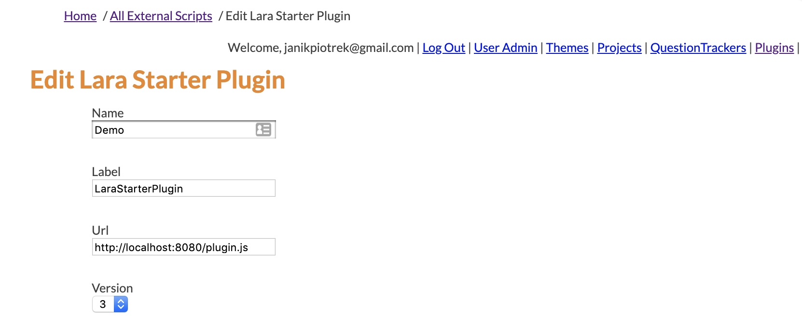

# LARA Starter Plugin

An empty plugin to use as a starting point when developing LARA plugins.
Although a LARA Plugin API Interface has been provided in `./src/lara/interfaces.ts`
it would be smart to check the
[current LARA API](https://github.com/concord-consortium/lara/blob/master/app/assets/javascripts/lara-api.js) in the
[LARA repo](https://github.com/concord-consortium/lara)

To install this plugin in LARA using a local server, login as an admin, and follow
the top navigation link to 'Plugins' and then create a new one. Set the plugin's
label to `LaraStarterPlugin` as defined in `plugin-condfig.tsx`.

---

---
To test it out create a new activity page, and add a new embeddable plugin. Specify
the new Plugin, and add authoring data JSON like `{ "helloText" : "Hello World" }`

## Development

### Initial steps

1. Clone this repo and `cd` into it
2. Run `npm install` to pull dependencies
3. Run `npm start` to run `webpack-dev-server` in development mode with hot module replacement

### Building

If you want to build a local version run `npm build`, it will create the files in the `dist` folder.
You *do not* need to build to deploy the code, that is automatic.  See more info in the Deployment section below.

### Notes

1. Make sure if you are using Visual Studio Code that you use the workspace version of TypeScript.
   To ensure that you are open a TypeScript file in VSC and then click on the version number next to
   `TypeScript React` in the status bar and select 'Use Workspace Version' in the popup menu.

## Deployment

*TODO* Set up Travis Deployment

Production releases to S3 are based on the contents of the /dist folder and are built automatically by Travis
for each branch pushed to GitHub and each merge into production.

Merges into production are deployed to http://lara-starter-plugin.concord.org.

Other branches are deployed to http://lara-starter-plugin.concord.org/branch/<name>.

You can view the status of all the branch deploys [here](https://travis-ci.org/concord-consortium/lara-starter-plugin/branches).

To deploy a production release:

1. Increment version number in package.json
2. Create new entry in CHANGELOG.md
3. Run `git log --pretty=oneline --reverse <last release tag>...HEAD | grep '#' | grep -v Merge` and add contents (after edits if needed to CHANGELOG.md)
4. Run `npm run build`
5. Copy asset size markdown table from previous release and change sizes to match new sizes in `dist`
6. Create `release-<version>` branch and commit changes, push to GitHub, create PR and merge
7. Checkout master and pull
8. Checkout production
9. Run `git merge master --no-ff`
10. Push production to GitHub

### Testing

Run `npm test` to run jest tests. Run `npm run test:full` to run jest and Cypress tests.

## License

This LARA Plugin is Copyright 2018 (c) by the Concord Consortium and is distributed under the [MIT license](http://www.opensource.org/licenses/MIT).

See `LICENSE` for the complete license text.
